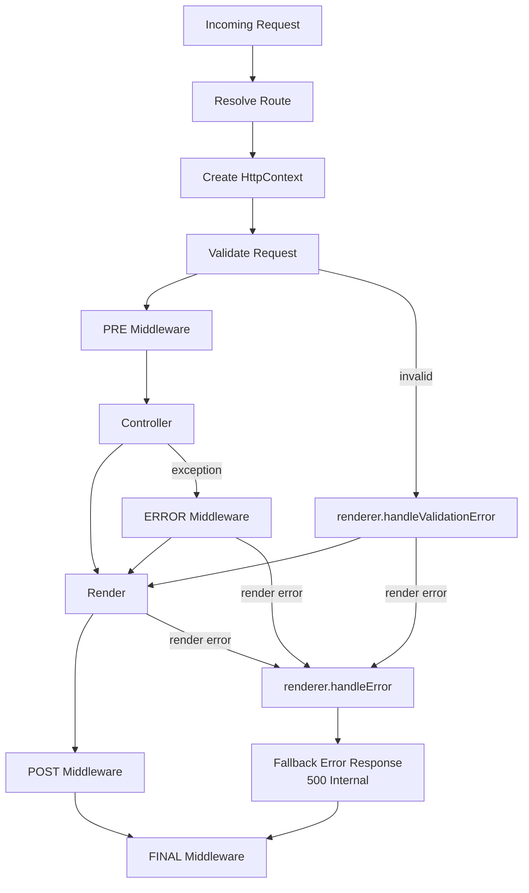

# `@kurdel/runtime` — Architecture

## Overview

### Runtime Execution Pipeline (Unified Diagram)

A single, structured overview of the Kurdel runtime lifecycle.

### High‑Level Pipeline Diagram



---

## Design Principles

* **Pure Orchestration** — The runtime coordinates execution without performing business logic.
* **Explicit Composition** — No decorators, reflection, or magic behaviors.
* **Deterministic Pipeline** — Every request flows through well-defined phases.
* **Request-Scoped IoC** — Each request receives an isolated dependency container.
* **Strong Typing** — All boundaries use strict TypeScript types from `@kurdel/core`.
* **Single Responsibility** — Router, Orchestrator, Pipes, and Context remain isolated.

---

## Responsibilities

### Runtime Provides

* Router execution
* Schema-driven request validation
* HttpContext construction
* Zoned middleware pipeline
* Controller execution pipeline
* Error, validation, and fallback handling
* Rendering delegation

### Runtime Does NOT Provide

* Server creation (delegated to adapters)
* HTTP body parsing
* Transport or network logic
* Business logic or controller instantiation rules

---

## Pipeline

The unified diagram above fully replaces previous duplicated diagrams.

The full lifecycle of an HTTP request:

```
1. Resolve Route
2. Create HttpContext
3. Validate Request (schema → DTO)
4. PRE Middleware Zone
5. Controller Execution
6. Rendering (unless manual)
7. POST Middleware Zone (only after render)
8. ERROR Middleware Zone (on exceptions)
9. FINAL Middleware Zone (always)
```

### 1. Route Resolution

* Delegated to the `Router` contract from `@kurdel/core`.
* Produces a `RouteMatch`, containing controller, action, middleware bindings, and schema.
* If route is missing → 404 fallback via `ResponseRenderer`.

### 2. HttpContext Creation

`RuntimeHttpContextFactory` constructs:

* request (raw + validated + params)
* response (renderer-bound)
* route metadata
* request-scoped IoC container

### 3. Request Validation

* Uses schema provided by the matched route.
* Validation occurs **before PRE middleware**.
* Any validation errors are normalized and passed directly to `renderer.handleValidationError`.
* Validation errors do **not** enter ERROR zone.

### 4. PRE Middleware Zone

* Runs global + controller-specific middleware for zone `pre`.
* May short-circuit by returning an `ActionResult`.
* If returned → immediately rendered.

### 5. Controller Execution

* Executed through `RuntimeControllerPipe`.
* Controller **must** return an `ActionResult` or `MANUAL_RESPONSE`.
* Returning `undefined` throws `ControllerActionMissingResultError`.

### 6. Rendering

* Delegated to `ResponseRenderer` from `@kurdel/core`.
* Skipped if controller returned `MANUAL_RESPONSE`.

### 7. POST Middleware Zone

* Executed **only after rendering succeeds** (`res.sent === true`).

### 8. ERROR Middleware Zone

* Triggered by runtime or controller exceptions.
* If middleware returns an `ActionResult` → rendered.
* Otherwise → fallback `renderer.handleError`.

### 9. FINAL Middleware Zone

* Always executed.
* Never affects response.

---

## File Structure *(without index.ts)*

Actual structure of `@kurdel/runtime`:

```
src/
  app/
    errors/
      module-validation-error.ts
      provider-configuration-error.ts
    lifecycle-manager.ts
    module-loader.ts
    module-priority.ts
    provider-registrar.ts
    runtime-application.ts
    runtime-composer.ts
    server-runner.ts

  http/
    is-http-error.ts
    noop-response-renderer.ts
    render-action-result.ts
    runtime-controller-pipe.ts
    runtime-controller-resolver.ts
    runtime-http-context-factory.ts
    runtime-middleware-pipe.ts
    runtime-middleware-registry.ts
    runtime-response-renderer.ts
    runtime-request-orchestrator.ts
    runtime-router.ts

  middlewares/
    create-validator.ts
    error-handle.ts
    json-body-parser.ts
    schema-validator.ts

  modules/
    controller-module.ts
    database-module.ts
    lifecycle-module.ts
    middleware-module.ts
    model-module.ts
    server-module.ts

  template/
    ensure-template-engine-binding.ts
    noop-template-engine.ts
```

---

## Key Components

### RuntimeRequestOrchestrator

Core coordinator of the full HTTP lifecycle.
Responsibilities:

* route resolution
* validation
* middleware zoning
* controller execution
* error and fallback handling
* delegating rendering

### RuntimeRouter

Stateless router evaluator.
Responsibilities:

* deterministic route matching
* no side effects
* providing `RouteMatch`

### RuntimeMiddlewarePipe

Executes an ordered list of middleware functions.
Responsibilities:

* pass-through execution
* short-circuit via returned result
* unified error propagation

### RuntimeControllerPipe

Executes controller actions.
Responsibilities:

* uniform call semantics
* strict result enforcement

### RuntimeHttpContextFactory

Builds request-scoped HttpContext objects.
Responsibilities:

* attach validated data
* bind route metadata
* expose response helpers

---

## Errors

Runtime uses a uniform error strategy.

### Validation Errors

* Do not enter `error` zone
* Normalized and rendered with `renderer.handleValidationError`

### Controller Errors

* Thrown exceptions → ERROR zone

### Missing Result Errors

* Returning `undefined` → `ControllerActionMissingResultError`
* Processed through ERROR zone

---

## Invariants

Runtime guarantees:

* every request resolves a route OR returns 404
* controller result is always explicit
* POST zone always follows render
* FINAL zone always executes
* validation is always performed once
* runtime never mutates RouteMatch

---

## Extensibility

Runtime allows extension through:

* custom middleware
* custom validation adapters
* custom response renderers
* custom platform adapters
* controller factories via IoC

---

## Non-Goals

Runtime avoids:

* decorators
* automatic serialization of arbitrary types
* implicit behavior based on metadata
* hidden DI containers

---

## Versioning Notes

This document describes the architecture for `@kurdel/runtime v0.1.0` and is considered stable for all minor versions of `0.1.x`. Future changes will be recorded in `CHANGELOG.md`.
